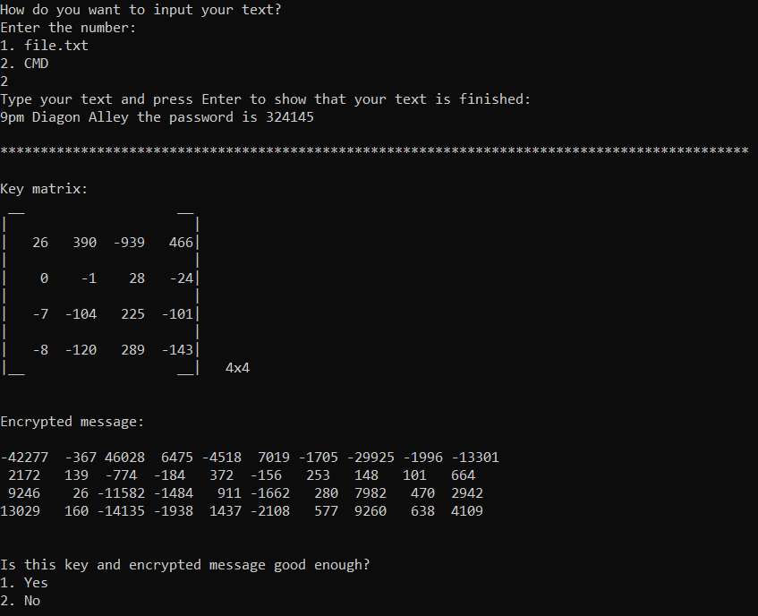

# HillCypher

This C program implements a simple encryption and decryption process using the [Hill Cypher technique](https://en.wikipedia.org/wiki/Hill_cipher). The user is prompted to enter a message, which is then encrypted using a randomly generated key matrix. The encrypted message and the key matrix are displayed together. The user is then asked if they want to use a different key matrix to encrypt the message. If the user chooses yes, a new key matrix is generated and the encryption process is repeated. The user can also choose to decrypt the message using the inverse of the key matrix.

The user can provide the input text either by entering it directly into the terminal or by specifying a text file.




To compile the programs, use the following command:

```bash
gcc "Encyption.c" -o output.exe -std=c99
```
And to run the programs, use the following command:

```bash
./output.exe
